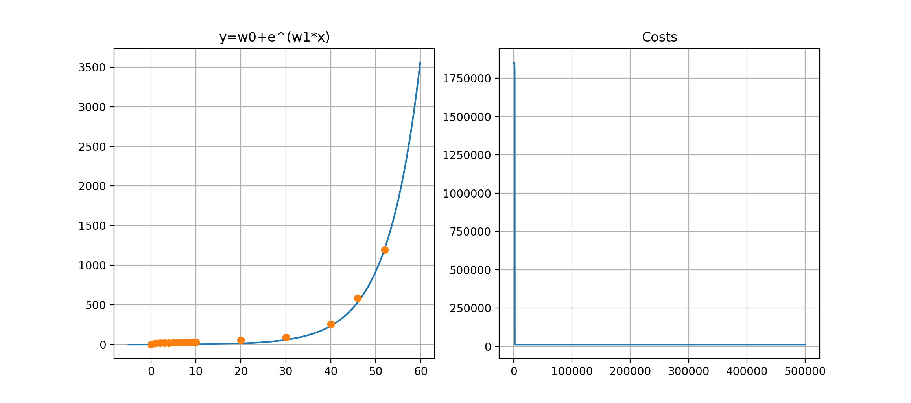
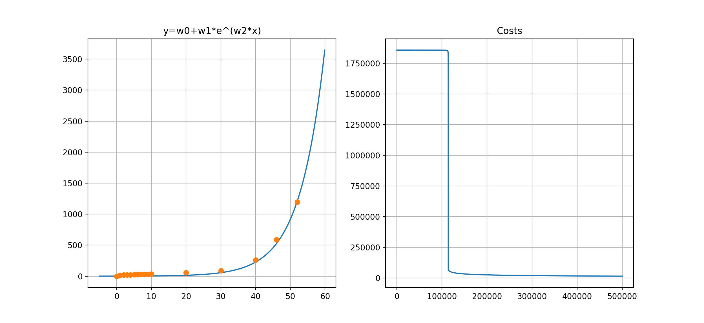
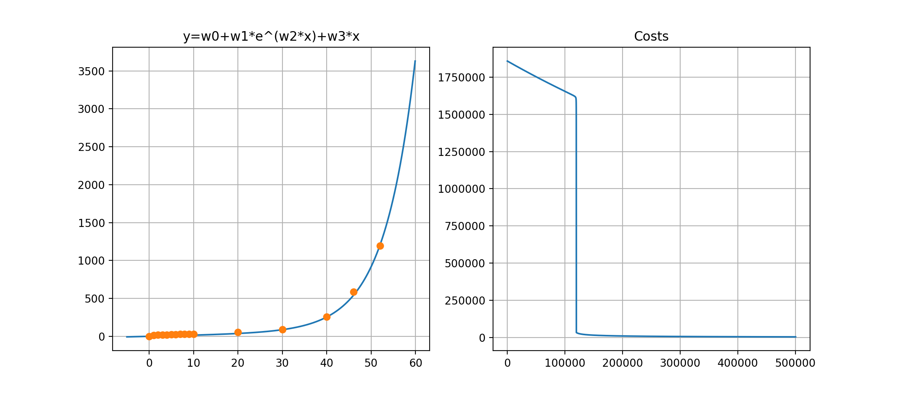
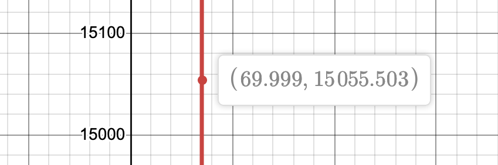

# Tests for COVID-19

- Author: Shinjo Sato
- Update: 09/04/2020

### Data
[特設サイト 新型コロナウイルス 都道府県別の感染者数 ... - NHK](https://www3.nhk.or.jp/news/special/coronavirus/data/)
```csv:covid.csv
# date (from 2/15), population
1 (2/15), ...
2 (2/16), ...

...

15 (3/1), ...

...

46 (4/1), ...
```

### Case 1



- $y = w_{0} + e^{w_{1}x}$

    data size = 16

  $
  \text{predict} = w_{0} + e^{w_{1}x}\\
  epochs = 500000\\
  \alpha = 0.00000001\\
  $
    ```
    final cost:  [1802715.05984969]
    weight:  [[11.67664894]
     [-8.7237475 ]]

    real    2m57.279s
    user    2m56.692s
    sys     0m0.336s
    ``` 


### Case 2



- $y = w_{0} + w_{1}e^{w_{2}x}$

    data size = 16

  $
  \text{predict} = w_{0} + w_{1} e^{w_{2}x}\\
  epochs = 500000\\
  \alpha = 0.00000001
  $

    ```
    final cost:  [13698.54922936]
    weight:  [[0.04352839]
     [0.86164262]
     [0.13940496]]

    real    4m6.827s
    user    4m6.202s
    sys     0m0.383s
    ```


### Case 3



- $y = w_{0} + w_{1} e^{w_{2}x} + w_{3}x$

    data size: 16

  $\text{predict} = w_{0} + w_{1} e^{w_{2}x} + w_{3}x\\
  epochs = 500000\\
  \alpha = 0.00000001
  $

    ```
    final cost:  [5190.48084584]
    weight:  [[0.03685179]
     [0.63106864]
     [0.14414915]
     [1.3518292 ]]

    real    5m16.612s
    user    5m8.752s
    sys     0m0.768s
    ```

### Result

$y = 0.037 + 0.631e^{0.1441x}+1.352x$

According to this formula, on ```25th April```, the sum of COVID-19 cases will become to ```15,056```.



