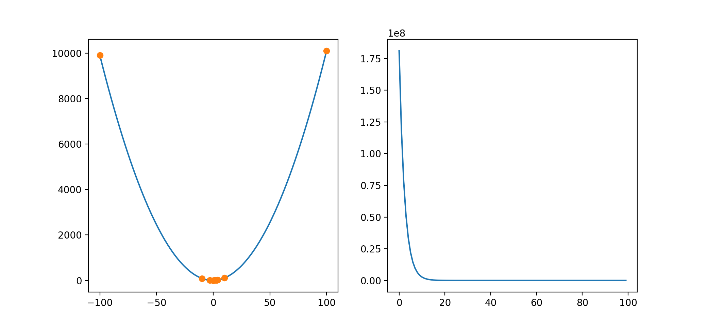
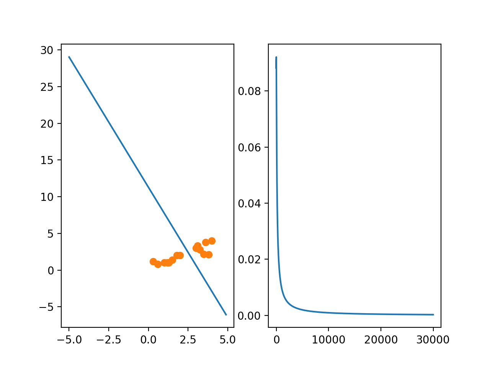

# Note

## Non-Linear Regression
- File: nonlinear.py



### Formula

- Prediction

    $\text{predict} = w_{0}x^{0} + w_{1}x^{1} + w_{2}x^{2}$

- Cost Function

    $\text{Cost} = \text{Cost} + (y - \text{predict})^{2}$

$
w_{0} = w_{0} - \alpha (y - \text{prediction}) * x^{0}\\
w_{1} = w_{1} - \alpha (y - \text{prediction}) * x^{1}\\
w_{2} = w_{2} - \alpha (y - \text{prediction}) * x^{2}
$

### Time
- With print()

    ```
    real    7m25.302s
    user    5m12.146s
    sys     0m11.949s
    ```

- Without print()

    ```
    real    2m26.448s
    user    2m24.759s
    sys     0m0.413s
    ```

## Multivariable-linear regression

- File: multivariable.py



### Formula

- Prediction

    $\text{sigmoid}(z) = \frac{1}{1 + e^{-z}}$

    $\text{predict} = \text{sigmoid}( w_{0} + w_{1}x_{1} + w_{2}x_{2} )$

- Cost Function

    if y = 1,

    $\text{Cost}(hw) = -1 * log(hw)$

    if y = 0,

    $\text{Cost}(hw) = -1 * log(1-hw)$

    $x_{2} = - \frac{w_{0} + w_{1}x_{1}}{w_{2}}$

### Time

- with print()

    ```
    real    14m0.179s
    user    9m48.175s
    sys     0m21.291s
    ```

- without print()

    ```
    real    6m0.187s
    user    5m58.561s
    sys     0m0.655s
    ```